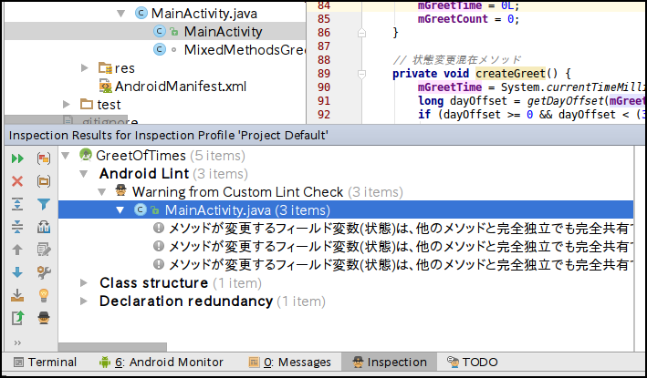

# Android Lint SRP Practice Example
[DroidKaigi 2017](https://droidkaigi.github.io/2017/)  
DAY.01 (Mar 9th, 2017)  
12:40 - JA 30min Room 1  
開発環境・ツール (Productivity and Tooling)  
インスペクションとAndroid Lint Custome Ruleによる、単一責任実装の実践 のサンプル・プロジェクトです。

## インスペクションについて
Android Studio には、<font color="blue">インスペクション</font>という強力なソース解析(指摘)機能があります。

1. 問題点のある実装部をエディタ上でハイライト表示します。

1. Analyze メニューの"Inspect Code..."により、
指摘一覧を <font color="blue">Inspection Resultsツールウィンドウ</font> にカテゴリ別でリストアップしてくれます。

<font color="blue">Inspection Resultsツールウィンドウ</font> に、Android Lint のチェック項目が反映されていることに気づかれていますでしょうか。

Android Studio のインスペクションには、<font color="blue">Android Lint も利用されている</font>のです。

## サンプル・プロジェクトの紹介
このサンプル・プロジェクトは、  
単一責任となるシンプルな実装の強制(強要)を促す、  
オリジナル Android	Lint Custome Rule のプロジェクトです。

フィールド変数（状態）を変更するメソッドが、  
複数存在（複合責務）する場合、その共有度合いから  
責務(役割)の混在の種類と問題についてレポートします。

<br/>

<center>
<br/>
(fig-1 Editor Inspection)
</center>
- 責務複合メソッドに対し<font color="blue">インスペクション</font>により、  
エディタ上でメソッド名がハイライト表示され、  
マウスオーバーで問題点のレポートが確認できます。

<br/>

<center>
<br/>
(fig-2 Analyze Inspection)
</center>
- Analyze ⇒ Inspect code... で、  
プロジェクト内に存在する問題(責務複合メソッド)箇所の一覧が確認できます。

<br/>

## 利用方法
- プロジェクト内のディレクトリ  
<font color="blue">supplementary</font> にある <font color="blue">lint-srp-example.jar</font> を  
<i>USER NAME</i>/.android/lint ディレクトリにコピーすれば  
Android Studio からサンプル機能が利用可能になります。


```bash
# MAC, Linux
$ mkdir ~/.android/lint
$ cp lint-srp-example.jar ~/.android/lint
```
<pre><code># Windows
> cd Users&yen;ユーザ名
> mkdir .android&yen;lint
> copy lint-srp-example.jar .android&yen;lint</code></pre>

## 制限事項
<font color="red">注意：</font>
サンプル・プロジェクトでは、  
Javaソース探索に<font
 color="blue">JavaPsiScanner</font>、  
Javaソース解析に<font color="blue">JavaElementVisitor</font> を使うため、  
以下の制限があります。  

- com.intellij.psi の AST パッケージを使っています。
- 既存の一次資料ドキュメントでは説明がありません。
- android/toolsの lint では使えません。

その他、以下のような制限があります。

- 限定条件下の責務複合メソッドを検出しているので、  
全てのパターンの検出や推論的な責務判断にまでは対応していません。

- チェックできるのはプリミティブ値のみ  
自クラスのプリミティブ値フィールドが対象です。  
他のクラス・インスタンスの状態変更は
対象外としてチェックしていません。  

- 処理単純化のため、  
内部クラスや匿名クラスでの状態変更については無視しています。

- 一部の環境では、日本語出力が文字化けします。  
*Ubuntu 16.04 LTS Android Studio 2.2 において、Inspection Results ツールウィンドウの右ペイン・メッセージで文字化けを確認しています。*
